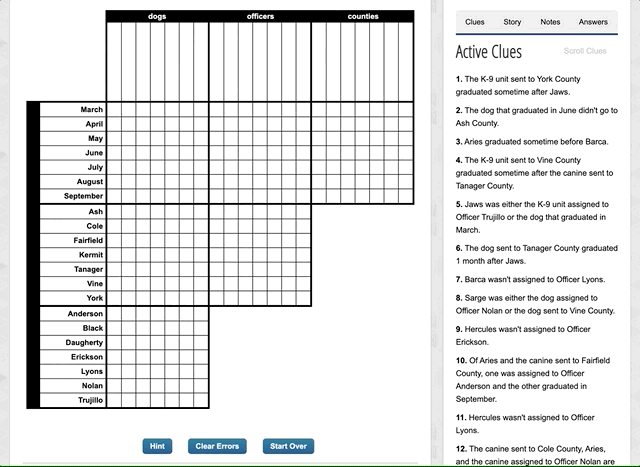
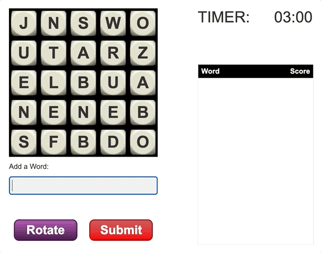
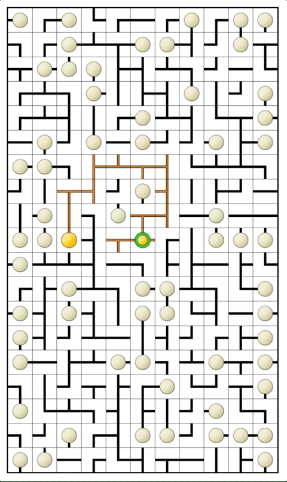
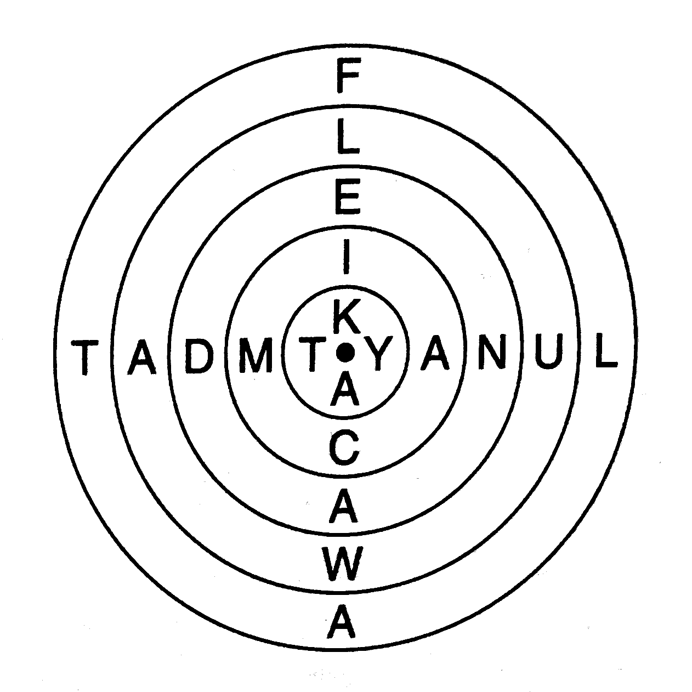
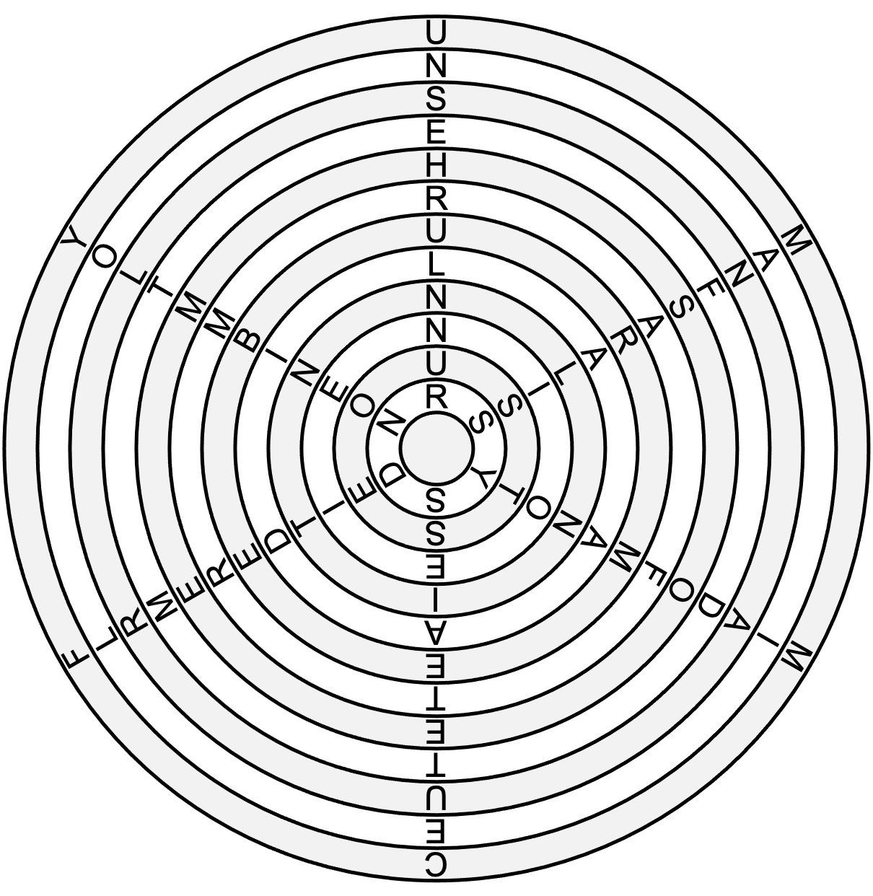
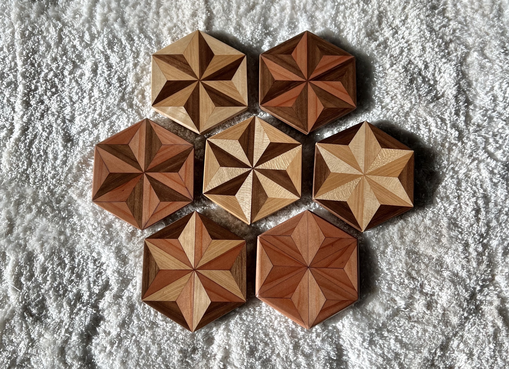
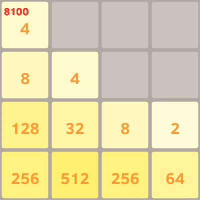
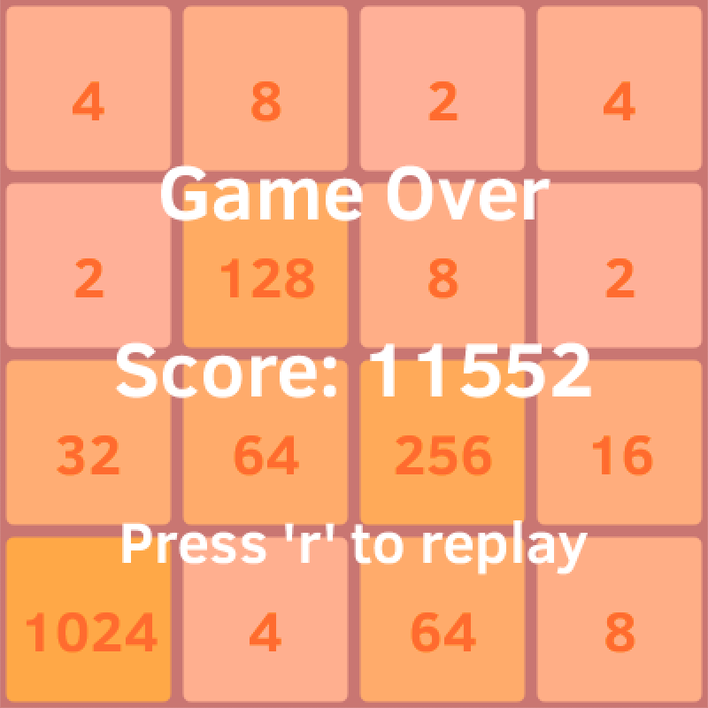

# Darci Peoples

Hello! I'm Darci Peoples (she/her) 👋

- 👩🏽‍💻 Software Engineer at Meta
- 🎓 Masters of Computer Science from UIUC
- 🤝 Connect with me on [LinkedIn](https://www.linkedin.com/in/darcipeoples/)
- 💻 View project source code on [GitHub](https://github.com/darcipeoples)

## Game Bots & Solvers

### "Operation Gumball" (Mastermind) Bot

I created a Python bot to automatically beat the game Operation Gumball. Operation gumball is a code guessing game (similar to Mastermind and Wordle). The bot makes use of Donald Knuth's five guess minimax Mastermind algorithm[^1], adapted for Operation Gumball. The bot is completely autonomous, needing no human input. It is able to input mouse and keyboard movements and interpret screen output to play an entire 30 level game.

<!-- (TODO: make gifs higher definition, there's not much harm in doing so) -->

[^1]: <a href="https://www.cs.uni.edu/~wallingf/teaching/cs3530/resources/knuth-mastermind.pdf" target="_blank">https://www.cs.uni.edu/~wallingf/teaching/cs3530/resources/knuth-mastermind.pdf</a> 

### Logic Puzzle Solver
I created a Python program capable of solving any Puzzle Baron logic puzzle. A logic puzzle provides a set of clues and categories. The player must use logical deduction to determine what entities correspond to what categories. To use the script, the user must transcribe each clue. E.g. "Opal played 1 game before Gail" turns into `[Player.Opal].games = [Player.Gail].games - 1`. And also provide units for any ordinal categories so these strings can be converted to numbers (e.g. "$5 thousand" --> `5000`).

<!-- (TODO: better puzzle description) -->

Future plans for the project include adding an online UI for ease of use.

A second, simpler bot can solve any puzzle up to 4x5 in size, given the puzzle URL. It does this by brute force checking board hashes against the solution hash given in the game HTML. This solver requires only the URL of the puzzle and no transcription of puzzles clues.

<!-- (TODO: repl link) -->

I've extended the bot to be able to automatically start & play games. It automatically starts games, scrapes the clues & categories from the HTML, translates them into clue types & values the program can understand, iteratively & recursively applies clue logic (similarly to a human, see ["How to Solve a Logic Puzzle"](https://logic.puzzlebaron.com/how-to-solve-a-logic-puzzle.php)), and submits the solution with Selenium.

To automatically parse the clues into something the program can understand, the bot uses heuristics derived from 30k+ puzzles scraped from the site.

### Wordle Solver

Using much of the same tactics as the Operation Gumball solver, my Wordle bot can solve World with 100% success rate. It uses a minimax algorithm to optimize for the best outcome (most elimiations) in the worst case (worst response coloring) each turn. It's recommended first word is "ARISE". This work came about before the rise in Wordle bots & optimal algorithms that have since determined "SALET" to be the best first guess via Information Theory.

Future work could include adding a UI instead of command line interface and utilizing Information Theory to reduce the number of average guesses required.

<!-- (TODO: repl link) -->

### "Draw My Thing" (Skribbl.io, Sketchful.io) Solver

I wrote a bot to spit out possible solutions for a given a partial word clue (e.g. "-um-k=n" --> "pumpkin"). Optimizations include progressively narrowing the possible word list (instead of starting from square one as each letter is revealed). This was my very first game bot which I made in high school, and I think it's a great way to get into the hobby.

"Draw My Thing", "Sketchful.io", and "Skribbl.io" are games in which players try to guess what someone is drawing as letters of the prompt are progressively revealed. In the future, this could better assist in Hangman by suggesting the best next guess based on remaining words. Other future work could include making a UI or browser extension.

### "Picnic" (Snake) Bot

"Picnic" is a snake-like game wherein you collect food until you run into a wall or your own ever-lengthening trail of ants. My bot complete a hamiltonian cycle of the board in order cover every square and achieve the highest score (on Easy). The bot cannot complete a game "Hard" difficulty because the Python screenshotting and keystroke libraries are unable to keep up with the requisite reaction times.

### "Wordtwist" (Ruzzle, Word Hunt, Boggle) Solver

Wordtwist is a Puzzle Baron game in which players are given a grid of letters and must create words by chaining adjacent letters. My Python solver takes in the text board and outputs the list of words, ranked in descending order of points. It finds these solutions via depth-first search (DFS) of the board and backtracking when a given partial path has no more possible words.

A second, more cheaty (and arguably, less fun) solver takes advantage of the underlying exposed APIs to simply fetch the list of solution words for a given board.

I extended the program to be able to automatically & repeatedly start and play games using Selenium.

### "Where's Wacky" (Memory Card Game) Bot

"Where's Wacky" is an online memory card game. My Python bot parses the cards on the screen and with perfect memory, clears boards in no time.

### "Booger Gets an A" Bot

In "Booger Gets an A", the player must click tiles that add to a given sum to eliminate them before the screen fills with tiles. My Python bot automatically parses the board & desired sum and simulates mouse presses to achieve superhuman scores.

### "Circuits" (Network Puzzle) Solver

"Circuits" is a Puzzle Baron network puzzle in which you try to connect all lightbulbs to the central battery (without any cycles or loose ends) by rotating the grid cells. My Python bot takes a board configuration as input and outputs the rotations to perform on each cell. It finds this solution by recursively applying restrictions of each cell's neighbors (e.g. to start, a wire end shouldn't point at an edge) until there is only one possible rotation per cell. If there is still more than one possibility, it chooses one & backtracks if that fails (e.g. creates cycle). During the search we also ensure there will only be one connected component (so all bulbs will touch battery) and that there are no cycles.

I've updated the bot to use Selenium to automaticall start & play games. It searches the game HTML for the starting board state, solves the puzzle (as before), and automatically submits the solution. It is substantially faster than any human. It could be faster by just sending web requests, but using the UI is way more fun (the same goes for many of the other games)!

### "Ringers" Solver
I wrote a bot to solve the "Ringers" word puzzle. My first attempt at the program used brute force. Still, I was able to write & run the program in less time than it took to solve 5 such puzzles manually. I've since updated the algoritm to use backtracking and it can now generate and solve a puzzle of any size in sub-second time (up to puzzles with 100 words of length 20).

**Game description:**
> Each of the five Ringers is composed of five rings. Use your imagination to rotate the ring so that you spell four 5-letter words reading from the outside to the insite when all the five rings are aligned correctly.

**Example board:**

<!-- (TODO: create repl & add link?) -->

**Example solution:**
FANCY, LLAMA, DOUBT, BROWN, SALAD

Here's a larger board generated using the program. The solution is 6 words that are each 12 letters long. Can you solve it?

<!-- (Answer: UNRESTRAINED, MALFORMATION, MISDEMEANOUR, CENTEREDNESS, FLAMMABILITY, YOUTHFULNESS) -->

## Woodworking

### Geometric Coaster Set

These coasters are my current favorite woodworking creation, but boy, were they time-consuming to make. I had an idea of what I wanted to make and the folks and the wood working shop were so helpful in making it a reality! I really like the end result and how the different woods catch the light.

These coasters are made of scrapwood; I think redwood, walnut, cherry, and maple. Each is made of 18 isosceles triangles. I cut 0.5 inch strips on the table saw then cut each triangle out with the miter saw. Then I sanded every triangle to ensure accurate angles and a snug fit. I glued sets of 3 traingles together to make a larger equilateral triangles & glued 6 of those together to make each hexagon (after sanding edges again). Each glue-up was held in place with rubber bands and a weight on top to keep it flat. Once glued up, I sanded glue off of the edges with the belt sander and taped them on plywood to send through the drum sander. I then hand sanded and raised the grain. I finished them with a coat of shellac followed by several coats of water-based polyeurathane and also stuck cut cork on the bottoms.

I cannot count how many hours these coasters took to make. But it was a fun time and I'm not against making them again. If I made them again, I'd probably avoid using the miter saw to cut the individual triangles; the pieces kept flying off or burning, even with a sacrificial fence and stop block. I'd like to make a jig to speed up triangle cutting or make it more consistent to avoid edge sanding before glue-ups. Or I could even use the CNC. Another option would be to cut long isosceles triangle prisms (strips), then just glue 18 of those together and slice the coasters off like bread. This would however make _end-grain_ coasters which may not catch the light as nicely. Also, when finishing, I'd use more coats of finish or make sure not to sand off as much between coats. Some coasters already have dents from being dropped, so a thicker finish could help them last longer.

### Infinity Cube

This infinity cube is meant to look like one continuous piece of wood. It's based off of a metal table I had seen online. It makes a good desk trinket & is surprisingly sturdy.

To make the infinity cube, I used scrap walnut wood. I cut it into 0.75" wide strips on the table saw, then 12 2.5" and 6 1.75" lengths on the bandsaw. I sanded each piece up to 220 before glueing them together (using a makeshift glue rig at home; bring out the heavy bottles and coasters for spacers 😆). I finished with a few coats of satin water-based polyeurathane using a foam brush, sanding between coats (likely too much). If I made this again, I might try a layer of shellac before the layer of poly to better bring out the wood. The proportions did turn out nicely.

### Scrap Wood Cutting Board

This cutting board was my first finished woodworking creation. It's made out of scrap wood; the middle strip is walnut and the others might be cherry and maple (not sure).

To make it, I trued up the boards, glued them together, planed it down, cut off the rough ends, and used a drill press to start the handle. I shaped the handle with a rasp and did lots of sanding (manual and not) to get it all feeling nice. I did raise the grain & sand once again. To finish it, I used mineral oil, just for a few hours.

This is a face-grain cutting board, so I'm not comfortable cutting on it, but it can be used as a cheese or serving board since it's food safe. I look forward to making an end-grain cutting board in the future.

<!-- (TODO: My 1st Bowl) -->

## Other Programming Projects

<!-- (TODO: videos/gifs/screenshots, demo links, & code links) -->

### Reddit BDI

Reddit BDI is a webapp to estimate a social media user's depression severity using their post & comment history. The app fetches the user's past comments and posts and feeds these through an ML model to predict responses to the Beck's Depression Inventory[^2] and thus estimate their corresponding depression severity. The model was trained on the data of 90 users provided by the CLEF eRisk 2021 Workshop. The site also provides mental health resources & allows users to submit their true BDI results for potential improvement of the model. The app was created using React, Python, Flask, TensorFlow, pushshift.io, and the Google Cloud Platform.

**Visit the site:** <a href="https://reddit-bdi.uc.r.appspot.com" target="_blank">https://reddit-bdi.uc.r.appspot.com</a>

**Project report:** <a href="./data/reddit-bdi-report.pdf" target="_blank">reddit-bdi-report.pdf</a>

[^2]: (Beck, A. T., Steer, R. A., & Brown, G. (1996). _Beck Depression Inventory–II_ [Database record]. APA PsycTests. <a href="https://doi.org/10.1037/t00742-000" target="_blank">https://doi.org/10.1037/t00742-000</a>)

### grok.date

<a href="https://grokdating.web.illinois.edu" target="_blank">grok.date</a> is a dating site intended for "geeks" (gamers, redditors, coders, etc.). It lets users import profile data from other social media (e.g. their subreddits) for easier account setup and transparent interest sharing. The app also has interest-based icebreakers and direct messages. The app was built using React, the Reddit API, Firestore, and cPanel.

**Visit the site:** <a href="https://grokdating.web.illinois.edu" target="_blank">https://grokdating.web.illinois.edu</a>

**About the site (video):** <a href="https://www.youtube.com/watch?v=FZoiCHPYWBE" target="_blank">https://www.youtube.com/watch?v=FZoiCHPYWBE</a>

### Bike Sharing Data Analysis and Narrative Visualization

In this narrative data visualization, I explore how weather, time of year, and time of day impact London bike share frequency. I also created a multiple linear regression model to predict bike sharing frequency based on these seasonal conditions, providing potentially useful insights for bike & scooter sharing companies and transport authorities.

**Narrative Visualization:** <a href="https://darcipeoples.com/bike-sharing-viz/" target="_blank">https://darcipeoples.com/bike-sharing-viz/</a>

**Data Analysis Report:** <a href="./data/bike-share-report.pdf" target="_blank">bike-share-report.pdf</a>

### Pixel Art Generator
This program takes as input an image to turn into pixel art and an available color pallete. It can be used for different mediums like Perler/fuse beads or in-game creations (e.g. in a sandbox game like Terraria or Minecraft, by providing the available block palette).

### 2048 Clone
This is a clone of the mobile app "2048". It was made with the Processing 3 language. Care had to be taken in how the tiles merge together. For example, merging down a stack of 3 tiles must merge the bottom two. And a stack of 4 must merge and then stack next to each other to prevent unintentional gaps.

<!-- (TODO: School Projects: Crackerjack, Piazza Improvements, Zombie VR game, interesting MPs?) -->

<!-- (TODO: Personal projects during school: CBTF scheduler, Stronghold finder, MapleJuice, Fishy, hangman (tiny), anagrams (tiny), wordhunt (nearly same as wordtwist)) -->

<!-- (TODO: Look through all folders/drives/githubs/linkedin for projects, etc.) -->

<!-- (TODO: Upload resume) -->

<!-- (TODO: Add resume sections:) -->

<!-- (TODO: Education - GPA, degrees) -->
<!-- (TODO: Jobs: E.g. FB, SF, RA, TA, CA, Sug Mama) -->
<!-- (TODO: Languages: E.g. Python) -->
<!-- (TODO: Courses: E.g. Security) -->
<!-- (TODO: Achievements: E.g. Dean's list, list of teachers ranked as excellent, WCS, Mu Alpha Theta, His Hon Soc, IL Tech Assoc Challenge, peer leadership) -->
<!-- (TODO: Leadership: E.g. WCS, GWC, BAAC, FBLA) -->

<!-- (TODO: Travel section? Iceland, Hawaii) -->